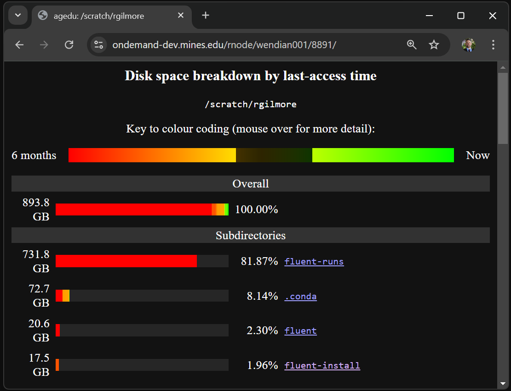

# Check File Age and Size (agedu)

This is a informative webpage using a Unix utility that indexes disk space [agedu](https://www.chiark.greenend.org.uk/~sgtatham/agedu/). The database updates once a day. To help users control shared file system usage the files 6-months or older are colored red, and the directory tree is navigated by links.

## Example of the agedu interface

## Starting agedu

Go to our Open Ondemand web portal [wendian-ondemand.mines.edu](https://wendian-ondemand.mines.edu). Using the "Files" tab select "Check File Age and Size (agedu)". Click launch, and wait for the server to start up. When a connection button appears click on this and a new window will open. Once your are finished you will need to stop the server under "jobs" or "My Interactive Session".

NOTE: This doesn't not run on a compute node, but rather the login node. So please ensure your server is stopped.

[//]: # "on Policy page - Check HPC usage ADD OOD. Data Policy page add agedu link. HPC Etiquette page ADD agedu. EDITS: to Running Matlab page add OOD"
