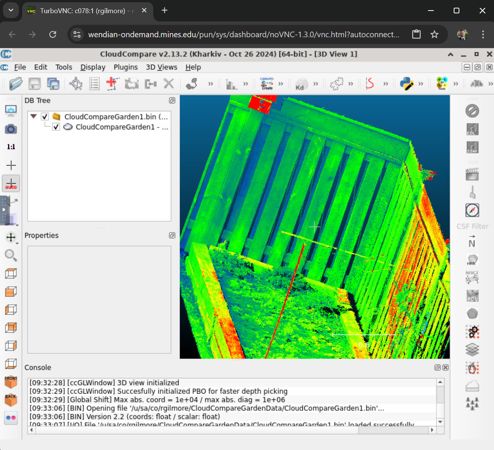

# Cloud Compare - Point Cloud Editor

Cloud Compare from [cloudcompare.org](https://cloudcompare.org) is a 3D point cloud (and triangular mesh) editing and processing software.

Designed to perform direct comparision between dense 3D point clouds using octree structures to optimize performance. Handling a large number of points, 10 million plus, on minimum hardware. Now supporting comparision algorithms between point clouds and triangle meshs with processes for registration, resampling, color/normal vectors/scalar fields management, staticstics computation, sensor management, interactive or automatic segmentation and more. Also, with display enhancement tools such as custom color, color & normal vector handling, calibrated picture handling, OpenGl shaders, plugins and more. See the [wiki documentation](https://cloudcompare.org/doc/wiki/index.php/Introduction)

Here's an example of Cloud Compare running on [Wendian-ondemand.mines.edu](https://wendian-ondemand.mines.edu)

## Starting Cloud Compare

Using our Open Ondemand portal at [Wendian-ondemand.mines.edu](https://wendian-ondemand.mines.edu) and selecting "Interactive Apps" then "Cloud Compare". Fill out the form fields to launch on one (1) compute node. This software isn't MPI enable. Select a GPU enabled partition to take advantage of GPU graphics acceleration using VirtualGL.

## Useful resources

A compilation of all videos related to CloudCompare [Youtube playlist](https://www.youtube.com/playlist?list=PLBNUxsUA00UAT63O0d95pByrCjtqlXN4_)

A series of vidoes by Eugene Liscio ([www.ai2-3d.com](https://www.ai2-3d.com), all rights reserved): [Youtube playlist by 3D Forensics](https://www.youtube.com/playlist?list=PLGmF5tE5UdyGXsCLbLN43M-PANXyaWZrz)

Short course at the Virtual Geoscience Conference 2021 (in English)

You can download the [course presentations (ppt)](https://drive.google.com/drive/folders/1-9IJETBxRYCjti7XHtt2hnG_8yYbBQvx?usp=sharing)

The above is the short list of resources [for the complete list](https://www.danielgm.net/cc/tutorials.html) visit the creators site.
