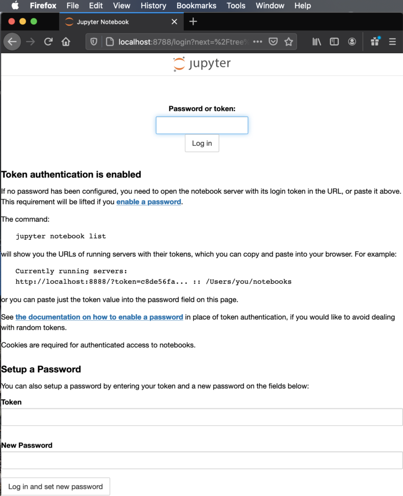

# Jupyter Lab on HPC platforms at Mines
The following is only for advanced users needing a special environment using your own Jupyter lab version, 
custom build widgets, etc.

## **IMPORTANT**: Most functionality that users will ever need from Jupyter Lab is immediately available 
Go to [wendian-ondemand.mines.edu](https://wendian-ondemand.mines.edu) and [mio-ondemand.mines.edu](https://mio-ondemand.mines.edu)
under “Interactive Apps.”

## DO NOT follow this guide unless you have tried using the above links, and have opened a ticket for help!

Starting a Jupyter Lab server for your personal use during simple development or editing is acceptable when CPU core 
use and memory usage is low.

Log in to the server with a SSH terminal session by making a tunnel from port 8788 open on your machine to the servers 
localhost and port 8888 on Mines' HPC Login node. These port numbers can be identical, for illustration purposes here they are
different and show clearly which computer host they belong too.

Connecting to a Jupyter Lab server running on a computer node requires starting an interactive job and a tunnel to the 
compute node. See below for an outline. For more details visit: [jupyter.org](https://jupyter.org)

#### Required Module for python

[joeuser@wendian001 ~$] `module load apps/python3`

### Compute Node Jupyter Lab

Log into Wendian and load the module for python:
[joeuser@wendian001 ~]$ `ml apps/python3`

Start an interactive job with a single task to run the Jupyter Lab server. This job will possible run on a 
shared node resource as it is requesting only a single core.  

[joeuser@wendian001 ~]$ `salloc -n1`

Start the Jupyter Lab with no browser and looking for a connection on port 8888, and broadcast the ip hostname 
of the node name. Here, this is “c078”

[joeuser@c078 ~]$ `jupyter-lab --no-browser --port=8888 --ip=$(hostname)`

If you have previous set up a password you'll see this. Where not connection token is listed.
```
[I 2024-12-11 16:09:58.359 ServerApp] jupyterlab | extension was successfully linked.
[I 2024-12-11 16:10:24.699 ServerApp] panel | extension was found and enabled by nbclassic. Consider moving the extension to Jupyter Server's extension paths.
[I 2024-12-11 16:10:24.699 ServerApp] panel | extension was successfully linked.
[I 2024-12-11 16:10:24.699 ServerApp] nbclassic | extension was successfully linked.
[I 2024-12-11 16:10:25.506 ServerApp] nbclassic | extension was successfully loaded.
[I 2024-12-11 16:10:25.508 LabApp] JupyterLab extension loaded from /u/aa/bb/joeuser/.conda/envs/myjupyter/lib/python3.7/site-packages/jupyterlab
[I 2024-12-11 16:10:25.508 LabApp] JupyterLab application directory is /u/aa/bb/joeuser/.conda/envs/myjupyter/share/jupyter/lab
[I 2024-12-11 16:10:25.513 ServerApp] jupyterlab | extension was successfully loaded.
[I 2024-12-11 16:10:25.513 ServerApp] panel | extension was successfully loaded.
[I 2024-12-11 16:10:25.514 ServerApp] Serving notebooks from local directory: /wendianHome/u/aa/bb/joeuser
[I 2024-12-11 16:10:25.514 ServerApp] Jupyter Server 1.9.0 is running at:
[I 2024-12-11 16:10:25.514 ServerApp] http://c078:8888/lab
[I 2024-12-11 16:10:25.514 ServerApp]  or http://127.0.0.1:8888/lab
[I 2024-12-11 16:10:25.514 ServerApp] Use Control-C to stop this server and shut down all kernels (twice to skip confirmation).
```
The line might look like this if it contains the access token:
```
The Jupyter Lab is running at:
https://localhost:8888/?token=f31f16637096193b500a0f1aa02a2344541c3023f35fef74
```

### Starting a Tunnel in a new terminal
Open a new terminal (Linux or MacOS) or Windows PowerShell to start an ssh tunnel to the compute node through the login node.

[joeuser@MyComputer ~ %] `ssh -L 8788:c078:8888 wendian.mines.edu`

### Connecting to the Jupyter Lab server

Open your web browser and connect to https://localhost:8788 or https://127.0.0.1:8788 and enter the token from the output 
when you started the jupyter lab server. Because the port numbers in the tunnel are different here you must change it to the 
tunnel ports (if there are the same you can copy the link with the token all-in-one) to connect to the running jupyter lab server.



After login is complete you will be shown the directory tree of files located on the server. You can open any browser supported 
file types for example, image files: .png, .jpg; embedded 3d objects in .html webpages, text files, and of course jupyter 
notebook files: .ipynb

## Stopping a Jupyter Lab
Stopping Jupyter Lab server can either be done in the terminal where you started it by pressing Crtl+C and confirming to shut 
the server down.

``` 
^C[I 15:08:03.885 LabApp] interrupted
Serving notebooks from local directory: /mioHome/u/aa/bb/joeuser
1 active kernel
The Jupyter Lab is running at:
https://localhost:8888/?token=f31f16637096193b500a0f1aa02a2344541c3023f35fef74
 or https://127.0.0.1:8888/?token=f31f16637096193b500a0f1aa02a2344541c3023f35fef74
Shutdown this lab server (y/[n])? y
[C 15:08:05.414 LabApp] Shutdown confirmed
[I 15:08:05.491 LAbApp] Shutting down 1 kernel
[I 15:08:05.993 LabApp] Kernel shutdown: 7e5e024b-f812-4f3d-a221-f778a8b4c81e
```

Or by selecting “Quit” or "Shutdown Server" in the directory tree tab in the upper right.

### Advanced Stopping a Jupyter Lab
If you have a Jupyter lab running either started with a “nohup” or running in the background of a terminal sometime 
you may have to investigate where it’s running. If you have the Module loaded you can try listing the notebooks running.

[joeuser@HPCsystem ~$] `jupyter server list`

```
Currently running servers:
https://localhost:8889/?token=7be1a092f6af2461cbeaeb666c73216b87ff7435c59280d1 :: /mioHome/u/aa/bb/joeuser
https://localhost:8888/?token=b407c83176ddb33197e4d250287460042f3df129ca4b3f79 :: /mioHome/u/aa/bb/joeuser
https://localhost:8890/?token=e5ef8cfb1bbd40adbb414b00be8a3dbf2034f7c3b994cf53 :: /mioHome/u/aa/bb/joeuser
``` 
This shows three jupyter lab server running all on different port numbers and with different access tokens. 
With a tunnel to any of these port numbes I could connect and quit each one, or to stop one of these servers use 
this command with the corresponding port number:
 
[joeuser@HPCsystem ~]$ `jupyter-lab stop 8889`
`Shutting down server on port 8889 ...`
Alternatively, you can search for process ID of all the running jupyter notebooks:

[joeuse@HPCsystem ~]$ `ps -aux | grep jupyter`
```
joeuser 24775  0.1  0.3 179404 50888 pts/11   S    17:14   0:00 /opt/python/anaconda3-2020.02/bin/python /opt/python/anaconda3-2020.02/bin/jupyter-lab --no-browser --port=8888
joeuser 24858  0.0  0.3 331600 56788 ?        Sl   15:39   0:02 /opt/python/anaconda3-2020.02/bin/python /opt/python/anaconda3-2020.02/bin/jupyter-lab --no-browser --port=8888
joeuser 28875  0.0  0.3 177384 52144 ?        S    15:46   0:00 /opt/python/anaconda3-2020.02/bin/python /opt/python/anaconda3-2020.02/bin/jupyter-lab --no-browser --port=8888
```
Some of these Jupyter-lab process are not connect to any terminal and will need to be stopped or kill with they 
process IDs (Second number). To kill the second process listed:

[joeuse@HPCsystem ~]$ `kill 24858`
 
## Advanced Startup of a Jupyter Lab Server

Starting a Jupyter Lab and leave it running to connect to later or in case you lose connection. 
Requires using the “nohup” command when starting the Jupyter Lab Server, and will need to be monitored 
to not accidentally leave jobs running.
