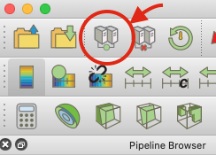
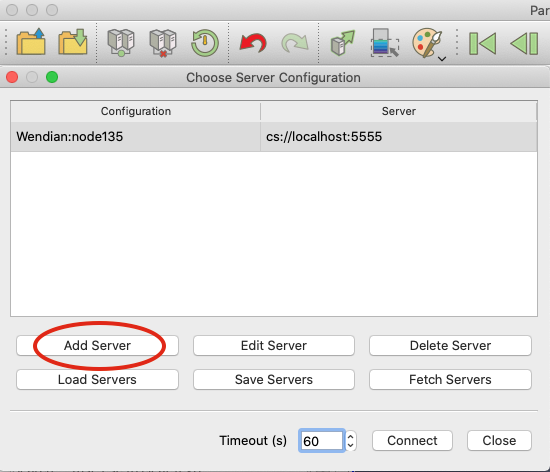
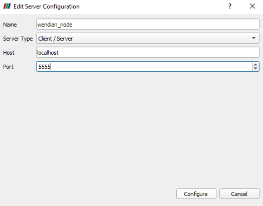
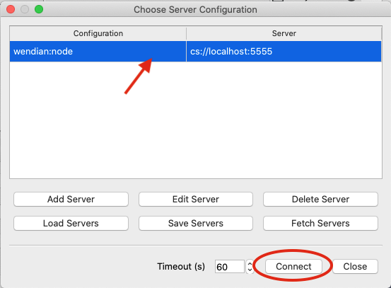

# Paraview Server Startup and Connection Guide

## Using ParaView by Connecting to a Server running on our HPC platform at Mines

ParaView is a visualization open-source software that runs in a server/client relationship scalable and 
useable across multiple platforms. This is a quick start access guide to starting a server running on 
Mines HPC platforms and connecting from your local client machine. Visit ParaView.org for 
software downloads to get a matching version to the HPC platform, and visit the ParaView Wiki for further
resources. This guide details configuration settings for Mines HPC using the following resources as a guide: 
[https://docs.paraview.org/en/latest/ReferenceManual/parallelDataVisualization.html](https://docs.paraview.org/en/latest/ReferenceManual/parallelDataVisualization.html)
and [https://hpc.llnl.gov/running-paraview-client-server-mode](https://hpc.llnl.gov/running-paraview-client-server-mode)

### Step 1: Creating a Job Submit Script and Submit

The following “paraview_server_job.submit” file is a sample Slurm submit script. Customize the job submit script 
as needed with the correct module version, and add your partition or account number as required.

```
#!/bin/bash
# SLURM submit file for Paraview server filename: paraview_server_job.submit
#SBATCH -ntasks 1
#SBATCH -t 00:30:00
# Set a port for running the paraview server connection
export PV_ACCESSPORT=11111

# Load module for Wendian
module load apps/paraview/gcc/5.13.0

# Load module for Mio
#module load apps/paraview/gcc/5.11.0

# For single CPU server job
pvserver  --server-port=$PV_ACCESSPORT 

# For parallel server
# mpirun -np $SLURM_NTASKS pvserver --server-port=$PV_ACCESSPORT
```

Submit your job to the Slurm scheduler using sbatch.

[joeuser@wendian001 ~]$ `sbatch paraview_server_job.submit`

### Step 2: What node is ParaView running on and setting up your tunnel

Once your job has started the file slurm-JOBID.out will contain the following lines:

```
Waiting for client...
Connection URL: cs://c078:11111
Accepting connection(s): c078:11111
```

Or check your SLURM queue for compute node hostnames with `squeue -u $USER`, and look under the heading `NODELIST (REASON)`.

### Step 2: Create a secure tunnel to the host from your client machine

Start a terminal (Linux or MacOS) or Windows PowerShell and run the following command. The first number of the SSH tunnel is  
a port number on your local machine, such as 5555. Followed by the hostname, here we have c078, and the final number is port 
number on the HPC node as stated “Accepting connections(s):” line from your slurm-JOBID.out containing the node and port number
(c078:11111). End the command with your username and the Mines HPC platform.

```
Windows PowerShell
Copyright (C) Microsoft Corporation. All rights reserved.

Install the latest PowerShell for new features and improvements! https://aka.ms/PSWindows
```
PS Z:\> `ssh -L 5555:node135:11111 janeuser@wendian.mines.edu`

### Step 3: Start ParaView and connect to the server

Open the ParaView Application on your local machine with the same version number as the Server running on the HPC Platform. 
To configure the connection click the “Connect” button in the top ribbon or go to menu item “File” -> “Connect…”



Select “Add Server” from the “Choose Server Configuration” window.



### Step 4: Adding the Server Configuration
In the “Edit Server Configuration” window give the connection a “Name” such as Wendian_node. Select the “Server Type” 
as “Client / Server”. The connection “Host” will be to the “localhost” SSH tunnel setup previously, and the “Port” 
number 5555. Continue the configuration by clicking “Configure”.



In the next window “Edit Server Launch Configuration” accept the default setting in “Startup Type” as “Manual” and 
click “Save” to return to the “Choose Server Configuration” window.


### Step 5: Connect to the Selected Server
In the “Choose Server Configuration” window highlight the server you wish to connect to and click “Connect”.



### Successful connection from ParaView client to a Remote Server on Mines' HPC

The connected server will now be displayed in the “Pipeline Browser” with the “Name” of the configuration, 
“Host” and “Port”. Open a data set, such as the tutorial file “can.ex2” and select the Variable to load and 
click “Apply” in the “Properties” to display the model.


## Closing Paraview
One the connection has been initiated to the Server running using the job submit script the running server 
will exit and the job will be complete. If you need to continue working, but need another dataset use the 
“Reset Session” button in the top ribbon or menu item “Edit” -> “Reset Session” to begin again.


